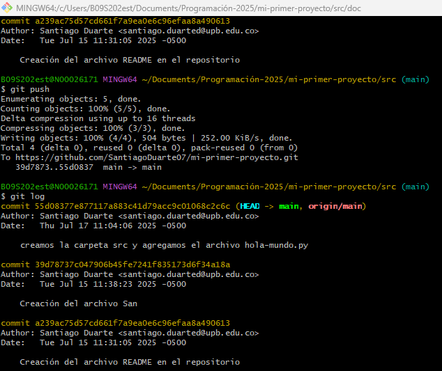

#1. Creamos cuenta en GitHub
#2. Creamos un repositorio, el cual le dimos nombre y le agregamos una descripcion
#3. Pegamos un link de GitHub a Git Bash con el comando git remote add origin
#4. Utilizamos el comando git push -u origin main para empujar los commits hacia GitHub

